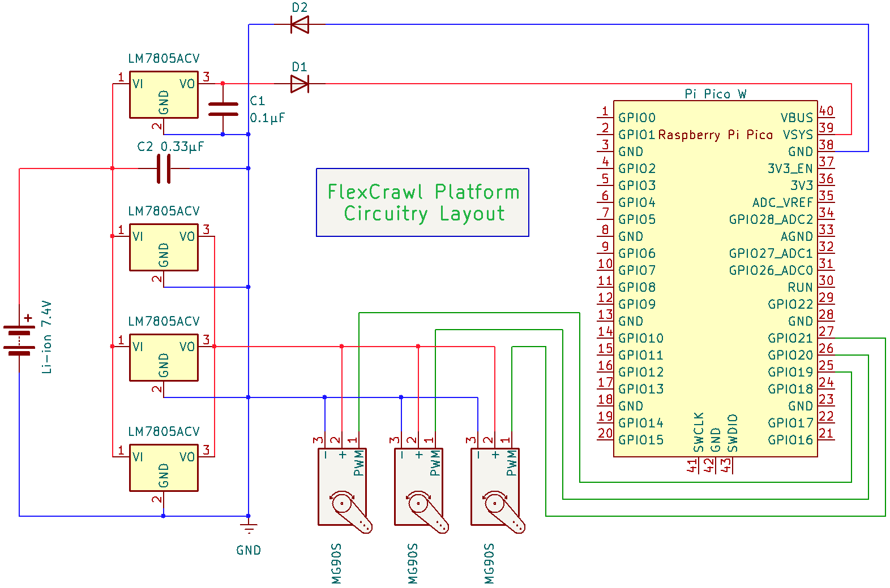

# Flexicrawl

This project contains code for the Flexicrawl project running University of Southern Denmark, SDU, for the Fall 2024 semester.

This project consists of the design and construction of a bio-inspired robot, with limbs made of soft material, allowing for locomotion.

The code in this repository enables the functionality of the robot, when it is assembled correctly.

## Building the robot

### Components List

- **1 pcs.**   Raspberry Pi Pico W
- **1 pcs.** Android-compatible Bluetooth gamepad, e.g. 8BitDo Pro 2 Bluetooth Gamepad
- **4 pcs.**   MG90S Micro Servo Motor
- **1 pcs.**   Li-ion-PO 7.4V 1000mAh battery
- **1 m.**      Fishing line
- **4 pcs.**   5V Linear Voltage Regulator (L7805ACV)
- **10 pcs.**  Female-Female Jumper Cables
- **1 pcs.**   USB to Micro-USB cable
- **12 pcs.** M2×7mm bolts
- **4 pcs.**  M2×16mm bolts
- **16 pcs.** M2 nuts
- **16 pcs.** M2 washers

In addition to the components listed, it is highly recommended to acquire a fireproof battery bag, a balanced cell charger, and a over-, under-charge alarm for the battery. Handle the Li-ion battery with care!
The electrical circuit may require more or less jumper cables, and with different connectors.

### Manufacturing and 3D printing

Any modern 3D printer should be able to print the parts required for this project. You will need either PLA or PETG for:

- Base
- Battery Mount
- End link
- Mounting clip
- Pulley
- Servo mount

Besides that, the legs need to be printed in PETG to be flexible and the fins need to be printed in TPU for bendability and grippyness.

### Assembly of Robot

Now that all the parts has been manufactured, it is time to assemble the robot. The robot can be assembled in different configurations to meet a specific task at hand. This configuration can be changed later if necessary.

#### Assembly of Limbs

One limb is constructed using the following parts:

- **1 pcs.**   Flexible 3D-printed or laser cut sheet
- **1 pcs.**   3D-printed magnet/motor mount
- **1 pcs.**   MG90S Micro Servo motor
- **1 pcs.**   Friction pad
- **2 pcs.**   Neodymium Magnets
- **1 pcs.**   3D-printed foot
- **$\approx 30cm$**   Fishing line
- **1 pcs.**   Pulley

Assemble the limb by following these steps:

- STEPS

#### Connecting Limbs to the Body

The limbs can be attached in many configurations around the robot's body. Determine a suitable position for the limb, and then dis-attach the ring cover from the underside of the robot's body with a twisting motion counter-clockwise. Carefully place two Neodymium Magnets in the indents at the chosen position in the robot body. Secure the ring cover over the magnets, by twisting it clockwise until it's locked in place.

Turn the robot around, and place the 3D-printed magnet/motor mount at the end of the limb above the magnets in the body. When the limb has snapped in place, insert a pin into the hole in the magnet/motor mount to lock it in place.

Repeat for the amount of limbs in the desired configuration.

#### Electrical Assembly

- **1 pcs.**   Raspberry Pi Pico W
- **1 pcs.**   Li-ion-PO 7.4V 1000mAh battery
- **4 pcs.**   5V Linear Voltage Regulator (L7805ACV)
- **10 pcs.**  M Jumper Cables
- **4 pcs.**   M3x15 Machine Screws

Secure the Raspberry Pi Pico W with four M3x15 machine screws in the middle of the robot body. Solder or use quick connect screw terminal blocks to replicate the schematic in [Electrical Schematic](#electrical-diagram):

#### Electrical Diagram



Use electrical tape to fasten components to the body if necessary, but keep in mind to keep weight as low as possible.

## Using the code

The "flexControl" arduino project contains code that should be run on the Raspberry Pi Pico W to control the servos, according to user defined gaits.

The code consists of three parts:

- A bluetooth handler, for obtaining user input from a bluetooth compatible joystick.
- The gait machine, which linearly interpolates between defined motor commands, to run a gait.
- The motor controller, which outputs the interpolated values from the gait machine to the servos on the limbs.

### Configuring the three motors and limbs

The limb and motor configuration, when limited to three each, can be updated simply in [flexControl/gaitMachine.cpp](flexControl/gaitMachine.cpp):

Set the motor configurations in the MotorConfigVector variable. A limb can be placed on either the left, center, or right side of the body.
A servo can be placed on either the left or right side of the servo mount as seen from the body out along the length of the limb.

```cpp
line 180:   MotorConfigVector motorConfigVector = {
line 181:     {BodySide::Left, ServoSide::Left},
line 182:     {BodySide::Center, ServoSide::Left},
line 183:     {BodySide::Right, ServoSide::Left}
line 184:   };
```

The index defines the limb and motor. These indexes are further defined in [flexControl/gaitMachine.h](flexControl/gaitMachine.h):

Define the motor id's. These define the order of the motors in regards to what limbs they are attached to.

```cpp
line 15:    enum Motors {Right=0, Tail=1, Left=2};
```

### Defining a gait

#### Example gait

A gait can be defined as follows:

```cpp
GaitStruct Caterpillar = {
  .initialMotorPositions = {0,0,0},
  .gait={
    {Tail,  0.68,  0,    0.2},
    {Left,  0.9,  0,    0.5},
    {Right, 0.9,  0,    0.5},
    {Tail,  0.2,  0.5,  0.2},
    {Left,  0,    0.8,  0.05},
    {Right, 0,    0.8,  0.05},
    {Tail,  0,    0.8,  0.2},
  },
  .gait_time=0.5,
  .gait_amp=0.5
};
```

It must then be inserted into the movementGaits variable in [flexControl/gaitMachine.cpp](flexControl/gaitMachine.cpp):

```cpp
line 177:   GaitVector movementGaits = {Crawler, Caterpillar, TailPush, BackJump};
```

It can then be selected by the arrow or X, B, Y, A buttons of the joystick, by selecting the currect button according to its index in the vector.

#### The code structure

A gait is a vector of motor commands, as well as amplitude and duration parameters and initial motor positions.

The GaitStruct type in [flexControl/gaitMachine.h](flexControl/gaitMachine.h) defines the gait:

```cpp
line 30:    struct GaitStruct{
line 31:      std::vector<float> initialMotorPositions = {0,0,0};
line 32:      Gait gait;
line 33:      float gait_time = 2;
line 34:      float gait_amp = 1;
line 35     };
```

The gait_time parameter is the duration of the gait in seconds. The gait_amp parameter is the amplitude of the gait as a percentage of the max motor value, which is given in degrees:

```cpp
line 90:    float MOTOR_MAX_VAL = 180;
```

The gait parameter is a vector of motorCMD:

```cpp
line 26:    typedef std::vector<motorCMD> Gait;
```

A motorCMD consists of a motor id, amount of gait amplitude in percentage, start time and duration as a percentage of gait duration:

```cpp
line 18:    struct motorCMD{
line 19:      Motors motorID;
line 20:      float amount;
line 21:      float start;
line 22:      float duration;
line 23:    };
```

### Changing the number of motors and limbs

The default code allows for three servos, but this can be modified.

#### Within the motor controller

Go into: [flexControl/motorControl.h](flexControl/motorControl.h)

Define the number of servos:

```cpp
line 36:    void loop(std::array<uint8_t, 3> servoVals);
line 39:    static const int NUM_SERVOS = 3;
```

Define the pins for each servo.

```cpp
line 42:    uint8_t servoPins[NUM_SERVOS] = {19,20,21};
```


Define the min and max pulse width in microseconds for the min and max angle of each servo (<https://docs.arduino.cc/libraries/servo/>):

```cpp
line 43:    uint16_t servoMins[NUM_SERVOS] = {544,544,544};
line 44:    uint16_t servoMaxs[NUM_SERVOS] = {2400,2400,2400};
```

#### Within the gait machine

##### Within the h file

Go into: [flexControl/gaitMachine.h](flexControl/gaitMachine.h)

Define the motor id's. These define the order of the motors in regards to what limbs they are attached to.

```cpp
line 15:    enum Motors {Right=0, Tail=1, Left=2};
```

Update the output from the loop function. The 3 should be changed to the number of motors:

```cpp
line 74:    std::array<uint8_t, 3> loop(bluetoothHandler::BluetoothOutput btIn);
```

Do the same for each of the arrays used to store motor values:

```cpp
line 83:    std::array<uint8_t, 3> program_end_motorpos = {0,0,0};
line 84:    std::array<float, 3> prev_M_pos = {0,0,0};
line 85:    std::array<float, 3> M_pos = {0,0,0};
line 87:    std::vector<float> MOTOR_INIT = {0,0,0};
line 98:    std::array<uint8_t, 3> motor_pos_array;
```

##### Within the cpp file

Go into: [flexControl/gaitMachine.cpp](flexControl/gaitMachine.cpp)

Set the motor configurations in the MotorConfigVector variable. A limb can be placed on either the left, center, or right side of the body.
A servo can be placed on either the left or right side of the servo mount as seen from the body out along the length of the limb.

```cpp
line 180:   MotorConfigVector motorConfigVector = {
line 181:     {BodySide::Left, ServoSide::Left},
line 182:     {BodySide::Center, ServoSide::Left},
line 183:     {BodySide::Right, ServoSide::Left}
line 184:   };
```

Add another mapping value to store the interpolated motor value:

```cpp
line 203:   static int M1_mapped = 0, M2_mapped = 0, M3_mapped = 0;
```

Expand the temporary motor position variables:

```cpp
line 217:   // Store initial motor values
line 218:   prev_M_pos[0] = MOTOR_INIT[0];
line 219:   prev_M_pos[1] = MOTOR_INIT[1];
line 220:   prev_M_pos[2] = MOTOR_INIT[2];
line 221:   M_pos[0] = MOTOR_INIT[0];
line 222:   M_pos[1] = MOTOR_INIT[1];
line 223:   M_pos[2] = MOTOR_INIT[2];
```

Expand the mapping and outputtin of motor values:

```cpp
line 266:   // Finally map the modified interpolated motor commands to the currect motor max and min values
line 267:   M1_mapped = mapToMotorValue(M_pos[0]);
line 268:   M2_mapped = mapToMotorValue(M_pos[1]);
line 269:   M3_mapped = mapToMotorValue(M_pos[2]);
line 270:   motor_pos_array = {(uint8_t)M1_mapped, (uint8_t)M2_mapped, (uint8_t)M3_mapped};
```

Expand the initial motor positions output (the {0,0,0}) from the selectGait function:

```cpp
line 303:   return {{0,0,0}, movementGaits[0].gait, 0, 0, 0.5, 0};
```
